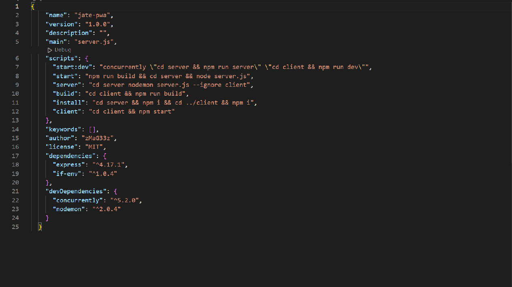
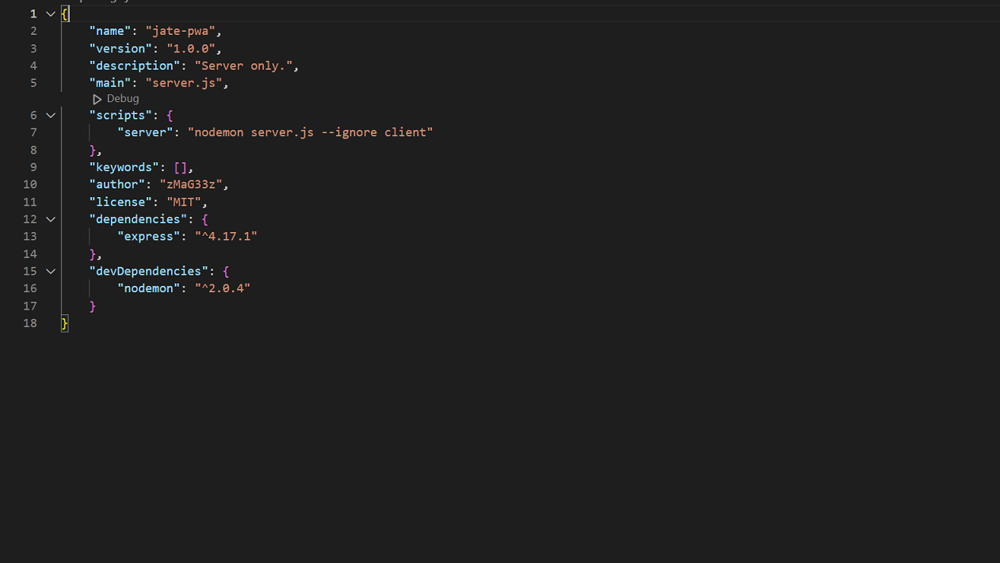
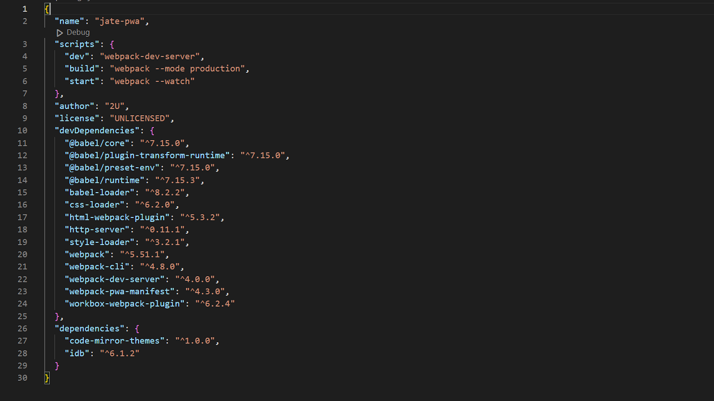
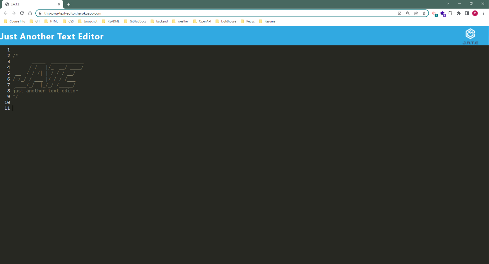
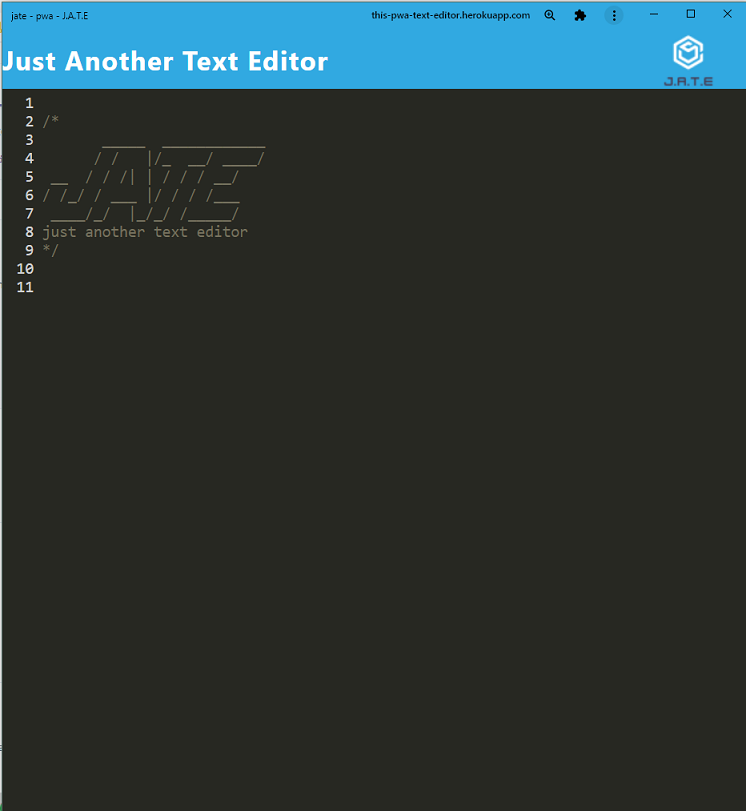

# **This-PWA-Text_Editor**

## Simple Text Editor designed to work with or without an internet connection.  So that information may be editable at any given time.  

### Table of Contents
- [Installations](#installations)
- [Usage](#usage)
- [Resources](#resources)
- [Location](#location)
- [License](#license)

## Installations:

 First to get started, Node.js was required.&nbsp;&nbsp;[*Node.js downloads*](https://nodejs.org/en/download/) 
Also a few devDependencies and dependencies.

**Node packet module file list:**
- devDependencies
  - 
  - 
  - 
  - 
  - 
  - 
  - 
  - 
  - 
  - 
  - 
  - 
  - 
  - 
  - 
  - 

- dependencies
  - 
  - 
  - 
  - 

**Each package.json preview:**
  - *Full Repo* folder package.json:
 
  - *Server* folder package.json:
 
  - *Client* folder package.json:
 
  
## Usage:
  
This PWA Text editor source code was provided to show the functionality of html webpack plugin and all the other accumlator/compiler/reader/writer files/packets that can be used to read/save/render data.

This is the *basic* functionality behind 'REACT' and a good example to be shown before the introduction of.

Showing the exhibition of loaders and how they compile data and then send information to a single source speeding up processing/display times.  This Text Editor itself demonstrates how locally stored data is faster and more user friendly.

The source code is just a simple example that can be used for an array of different ideas.

Here we are creating a *data entry window* aside from the browser, but, using the browser's built in capabilities available.  This *data entry window* application can be used with or without a connection.  Utilizing the required packet node files, together they gather text input from the *data entry window*, then write it to a manifest file, which then will be injected to the web browser's index file for display.

***Beginning Online Mode***
  - 

***Beginning Offline Mode***
  - 

***Walkthrough Video***
  - Walkthrough [*click here*.](https://drive.google.com/file/d/1jzKGmV2iLJwWlIiyEI50UbRGXu7J2Ppz/view)

## Resources:

[Google](https://www.google.com)

**_Original Source Code:_**&nbsp;&nbsp;[provided by UTexas.edu](https://techbootcamps.utexas.edu/coding/)

## Location:

Live URL:&nbsp;&nbsp;[Heroku - This PWA Text Editor](https://this-pwa-text-editor.herokuapp.com/)

Code Location:&nbsp;&nbsp;[GitHub Repository](https://github.com/zMag33z/week-19_PWA-Text_Editor/)

## License:
  

  
See *Terms & Conditions* of the license [***here***](https://opensource.org/licenses/MIT).

 

#### [**Back to top**](#)